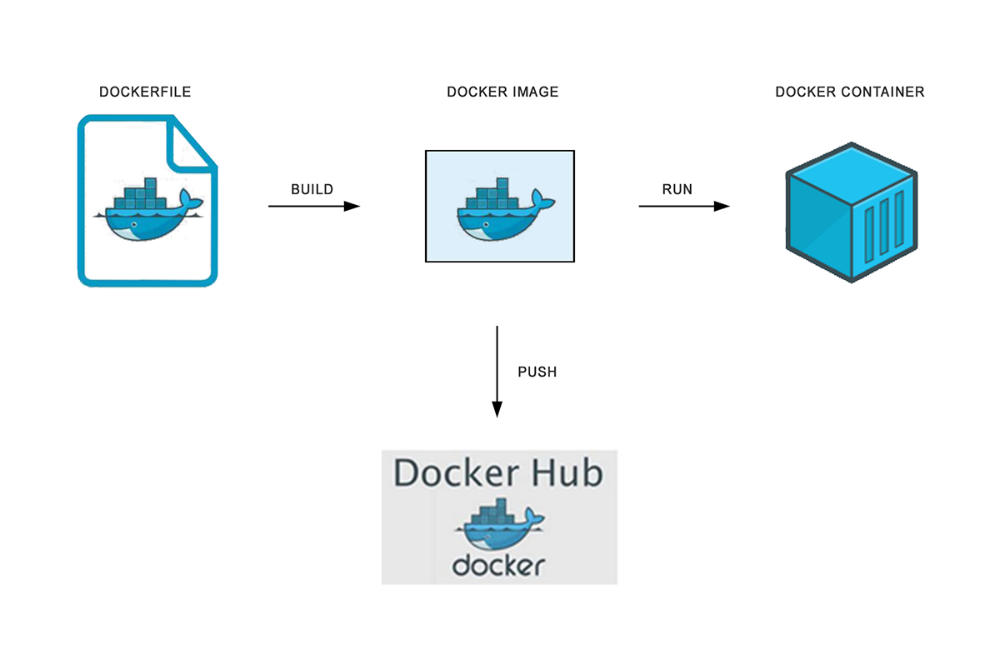

# Docker

## Comparação de Containers vs VMs

## Fluxo do Docker

## What are containers

Containers são processos, executados de forma isolada no Linux utilizando alguns recursos do próprio Linux como:

- Namespaces
- Chroot
- Cgroup (control groups)

Há 8 namespaces utilizados no Linux:
[https://en.wikipedia.org/wiki/Linux_namespaces](https://en.wikipedia.org/wiki/Linux_namespaces)

- Mount (mnt)  
  Namespace para isolar pontos de montagem

- Process ID (pid)  
  Namespace para isolar processos

- Network (net)  
  Namespace para isolar as interfaces de rede

- User ID (user)  
  Namespace para isolar usuários

- Control group (cgroup)  
  Namespace para isolar a alocação de recursos tais como tempo da CPU, memória do sistema, largura de banda

- Interprocess Communication (ipc)  
  Namespace para isolar comunicação inter-processos

- UNIX Time-Sharing (UTS)  
  Namespace para permitir que processos diferentes possam ter um host e domínio diferente

- Time Namespace  
  Namespace para permitir que processos diferentes possam ter diferentes system times (horários do sistema)

> Tecnologias subjacente do Docker:

[https://docs.docker.com/get-started/overview/#the-underlying-technology](https://docs.docker.com/get-started/overview/#the-underlying-technology)
