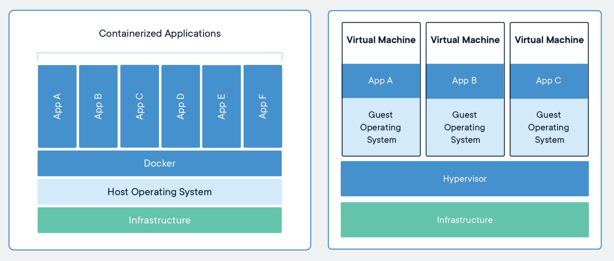

# Docker

## What are containers

Nothing but a process, isolated by the Linux system using some features of the Linux itself:

- Namespaces
- Chroot
- Cgroup (control groups)

There are 8 kinds of namespaces used in Linux:
[https://en.wikipedia.org/wiki/Linux_namespaces](https://en.wikipedia.org/wiki/Linux_namespaces)

- Mount (mnt)
- Process ID (pid)
- Network (net)
- User ID (user)
- Control group (cgroup)
- Interprocess Communication (ipc)
- UNIX Time-Sharing (UTS)
- Time Namespace

> Docker underlying technologies

[https://docs.docker.com/get-started/overview/#the-underlying-technology](https://docs.docker.com/get-started/overview/#the-underlying-technology)

## Containers vs VMs comparison

## Docker flow

